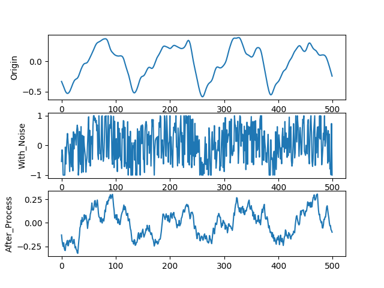

# LMS滤波器
LMS滤波器是自适应滤波器的一种最优准则,即最小均方差准则.
>自适应滤波:就是利用前一时刻以获得的滤波器参数的结果，自动的调节现时刻的滤波器参数，以适应信号和噪声未知的或随时间变化的统计特性，从而实现最优滤波。自适应滤波器实质上就是一种能调节自身传输特性以达到最优的维纳滤波器。自适应滤波器不需要关于输入信号的先验知识，计算量小，特别适用于实时处理。维纳滤波器参数是固定的，适合于平稳随机信号。卡尔曼滤波器参数是时变的，适合于非平稳随机信号。然而，只有在信号和噪声的统计特性先验已知的情况下，这两种滤波技术才能获得最优滤波。在实际应用中，常常无法得到信号和噪声统计特性的先验知识。在这种情况下，自适应滤波技术能够获得极佳的滤波性能，因而具有很好的应用价值。

>常用的自适应滤波技术有：最小均方（LMS）自适应滤波器、递推最小二乘（RLS）滤波器格型滤波器和无限冲激响应（IIR）滤波器等。这些自适应滤波技术的应用又包括：自适应噪声抵消、自适应谱线增强和陷波等。

## LMS自适应滤波器原理:
原理:


滤波：  $y(n)= w^T(n)*x(n)$

误差计算：  $e(n)=d(n)-y(n)$

更新滤波器系数： $w(n+1) = w(n) +2\mu*e(n)*x(n)$

## 源代码:
代码三个部分:

1.给原始音频加上噪声:
```
import soundfile as sf
import os
import numpy as np

path = 'Paragon.flac'
path_with_noise = 'Paragon_with_noise.flac'
data,samplerate = sf.read(path)
data = np.array(data)
data_with_noise = data + (np.random.rand(data.shape[0],data.shape[1])-0.5)*2
#print("max = " + str(np.min(data)) + "\nmin = " + str(np.min(data)))
if (os.path.exists(path_with_noise)==0):
    sf.write(path_with_noise, data_with_noise, samplerate) 
```


2.滤波器和滤波部分:
```
import numpy as np
from create_noise import data_with_noise,samplerate
import soundfile as sf
import os

path_after_process = "Paragon_after_process.flac"


#xn:2*(n*1),dn:n*1,M,mu,
#w:M*n,en:n*1,yn:n*1

#e(n) = d(n) - y(n) = d(n) - x(n).T*w(n)
#w(n+1) = w(n) + 2*mu*e(n)*x(n)
def LMSFilter(xn,dn,M,mu,err):
    L = xn.shape[0]
    w = np.zeros(M)

    for k in range(L)[M:L]:
        x = xn[k-M:k][::-1]
        en = dn[k] - x.T.dot(w)
        if(en>err):
            break
        w = w + 2*mu*en*x
    
    yn = np.zeros(L)
    for k in range(L)[M:L]:
        x = xn[k-M:k][::-1]
        yn[k] = w.T.dot(x)

    return yn,w,en

dn,_ = sf.read('Paragon.flac')
dn1 = dn[:,0]
dn2 = dn[:,1]
M = 20
mu = 1e-6
err = 100
data_after_process = data_with_noise
data_after_process[:,0],_,_ = LMSFilter(data_with_noise[:,0],dn1,M,mu,err)
data_after_process[:,1],_,_ = LMSFilter(data_with_noise[:,1],dn2,M,mu,err)
if (os.path.exists(path_after_process)==0):
    sf.write(path_after_process, data_with_noise, samplerate)
    print("done!\n")
else:
    sf.write(path_after_process + ".bak", data_with_noise, samplerate)
    print("already exist,done with saving with \'.bak\'\n")
```

3.画图部分:
```
import matplotlib.pyplot as plt
import numpy as np
import os
import soundfile as sf
import sys

def plot(length,dir,title):
    data,samplerate = sf.read(dir)
    data = np.array(data)
    d = data[rand:rand+length,rand1]
    plt.ylabel(title)
    plt.plot(d)

if(len(sys.argv)>1):
    length = int(sys.argv[1])
else: 
    length = 500

data,_ = sf.read('Paragon.flac')
rand = np.int(np.random.rand()*(data.shape[0]-length-1))
rand1 = np.int(np.random.rand())
plt.figure()
plt.subplot(3,1,1)
plot(length,'Paragon.flac',"Origin")
plt.subplot(3,1,2)
plot(length,'Paragon_with_noise.flac',"With_Noise")
plt.subplot(3,1,3)
plot(length,'Paragon_after_process.flac',"After_Process")
plt.savefig("3.png",format = "png")
plt.show()
```
## 结果分析:
下面三张图显示了随机在左右声道上的长度为500的声音序列,原始声音,加噪声信号和滤波器处理后的信号的对比.





可以看出,在加上较大的白噪声后,通过LMS自适应滤波器,可以很好的恢复出原始信号.